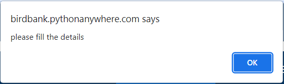
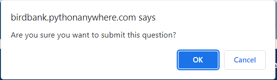

One of the common challenges in web testing is handling alerts and pop-ups that appear during the execution of test cases. Selenium provides several methods to handle alerts and pop-ups in web applications.

In web applications, there are mainly three types of alerts that can appear:

### Simple Alert
A JavaScript alert is a popup that appears on the browser window to notify the user about a certain event or condition. It usually contains a message and an OK button. JavaScript alerts can be handled using the Alert Interface in Selenium.

### Confirmation Alert
A JavaScript confirmation is a popup that appears on the browser window to ask the user to confirm or cancel an action. It usually contains a message, an OK button, and a Cancel button. JavaScript confirmations can be handled using the Alert Interface in Selenium.

### Prompt 
A JavaScript prompt is a popup that appears on the browser window to ask the user to enter a value or provide some input. It usually contains a message, an input field, an OK button, and a Cancel button. JavaScript prompts can be handled using the Alert Interface in Selenium.